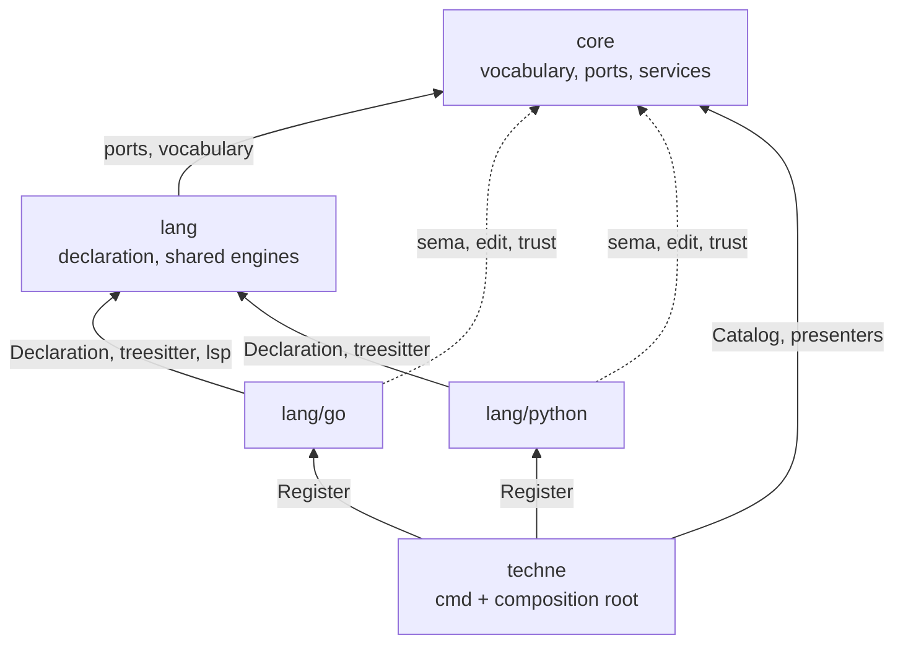

# RFC-0001: Module boundaries

## Summary

Split techne into four Go modules in one repository: `core` holds
everything that does not know a language, `lang` holds machinery more
than one language uses, `lang/<x>` holds one language each, and the root
module holds the binary. Dependencies run one way: a language module may
import `lang` and `core`, `lang` may import `core`, `core` imports none
of them, and only the root module imports a language module. Adding or
removing a language is then a directory plus two lines, and `core`
compiles without a C toolchain.

## Motivation

Grammar bindings are cgo. A tree-sitter binding needs a C compiler to
build at all, and each grammar on top of it is a package of generated C.
In a single module that cost cannot be contained:
`go build ./...` compiles every package in the module, so one grammar
anywhere means the whole module needs a C toolchain, `CGO_ENABLED=0`
stops working, and cross-compiling to a platform with no C
cross-toolchain stops working. Every language techne serves at the
syntactic tier adds one of these.

The second cost is deletion. Support for a language is a declaration,
some queries, sometimes an engine, and a line of dispatch wherever the
system chooses what to run. Spread across one module, removing a language
means finding those references and deciding which of them are shared.
This layout is built so that deleting one directory and one line from
`go.work` removes a language completely, with nothing else in the tree
mentioning it.

The third is the dependency ledger. Go support needs
`golang.org/x/tools`; a language served by a language server needs an LSP
client; each grammar is its own module. Put them in one module and every
consumer's `go.sum` lists all of them, whether or not that consumer ever
asks about that language.

**Why this belongs at the module layer.** All
three costs are about a *dependency set*, and the module is the unit in
which Go declares dependencies. Splitting into packages inside one module
changes none of it: `go.sum` still lists every grammar, `go build ./...`
still compiles every package, and `go get` still resolves the union.
Package boundaries control which package may import which. They do not
control what `go get` downloads or what the linker includes.

## Detailed design

### The module graph

| Directory | Module path | Holds | cgo |
|---|---|---|---|
| `techne-core/` | `go.dokimi.dev/techne/core` | Vocabulary, engine ports, catalog, read and write services, index, tool interface, presenters | no |
| `techne-lang/` | `go.dokimi.dev/techne/lang` | Language declaration, engines more than one language uses, conformance suite | in `lang/treesitter` only |
| `techne-lang-go/` | `go.dokimi.dev/techne/lang/go` | Go: queries, a `go/types` engine, planners | via `lang/treesitter` |
| `techne-lang-<x>/` | `go.dokimi.dev/techne/lang/<x>` | One language each | via `lang/treesitter` |
| `.` | `go.dokimi.dev/techne` | `cmd/techne`, composition root, version stamp | inherited |



### The four rules

1. `core` imports nothing else in this repository.
2. `lang` imports `core` and nothing else in this repository.
3. `lang/<x>` imports `core` and `lang`, never another `lang/<x>`.
4. Only the root module imports a `lang/<x>`.

Rule 1 keeps `core` free of cgo and of every language ecosystem. Rule 3
makes a language deletable: nothing but the root module names it. Rule 4
keeps the graph acyclic, and it is the reason the binary lives in its own
module rather than in `core`.

Check them with the go command rather than by reading. Ask for the module
each dependency belongs to, not for its import path:

```bash
# Run from a module directory with that module's allow-pattern.
allowed='^go\.dokimi\.dev/techne/core$'                 # techne-core
allowed='^go\.dokimi\.dev/techne/(core|lang)$'          # techne-lang
allowed='^go\.dokimi\.dev/techne/(core|lang|lang/go)$'  # techne-lang-go

violations=$(go list -deps -f '{{if .Module}}{{.Module.Path}}{{end}}' ./... \
  | sort -u | grep '^go\.dokimi\.dev/techne' | grep -Ev "$allowed" || true)

[ -z "$violations" ] || { printf 'forbidden dependency:\n%s\n' "$violations"; exit 1; }
```

The module path matters here rather than the import path, because a
language module's path sits *underneath* `lang`'s. Testing an import path
for the prefix `go.dokimi.dev/techne/lang` matches
`go.dokimi.dev/techne/lang/treesitter`, which rule 2 allows, and
`go.dokimi.dev/techne/lang/go`, which it forbids. `.Module.Path` reports
which module a package was resolved from, so the two are distinguishable
and the anchored patterns above are exact. This runs as a stage in the
pre-merge gate.

Keep the `|| true`. `grep` exits 1 when it matches nothing, and here that
is the passing case, so without it the gate fails every clean build under
`set -e`.

### What core holds

```
techne-core/
  doc.go
  source/            Language, Path, Position, Span         where code lives
  sema/              Symbol, ID, Kind, Relation, Unit, Ref   what it means
  trust/             Fidelity, Status, Caveat, Provenance    how sure we are
  edit/              Operation, Family, Target, Spec, Plan   how it changes
  diag/              Diagnostic, Severity, Fix               what is wrong with it
  engine/            Role, Cost, the port interfaces, Catalog, Capability
  query/             the read path, strongest engine first
  change/            the write pipeline
  gate/              verification
  workspace/
    index/           Store and Source ports, boot scan, staleness
    files/           filesystem operations, produced as edit.Plan
    project/         which workspace a path belongs to
  tool/              the tool interface: name, summary, derived schemas
  presenter/
    mcp/
    cli/
```

The five vocabulary packages sit at the top level rather than under a
group of their own, because the module name already says what they are.
`workspace/` keeps its group: without it a reader meets `files` beside
`query` and `change` and has to work out that one of the three is not a
service.

Presenters live here rather than in the root module because a presenter
needs the tool interface and nothing else. In `core` a presenter is
imported as `go.dokimi.dev/techne/core/presenter/mcp` and requires no
language module. In the root module it would be
`go.dokimi.dev/techne/presenter/mcp` and would require all of them.
Someone embedding techne's MCP server for a language set they choose
needs presenters without grammars, and `core` is the only module where
that builds. The cost is that `core` carries the MCP SDK and cobra in its
`go.mod`; see Drawbacks.

### What lang holds

```
techne-lang/
  doc.go             package lang: Declaration, CommentStyle, Register
  treesitter/        the grammar-driven engine                    (cgo)
  lsp/               the language-server engine
  command/           the subprocess engine, for formatters and verifiers
  conformance/       the suite every language module runs
```

A package belongs here when more than one language can use it. A
`go/types` engine is engine-shaped and still belongs in the Go module,
because no other language can use it, and filing it here would put Go's
implementation where a reader asking what techne does about Go would not
look.

Only `lang/treesitter` is cgo. Go compiles just the packages a binary
reaches, so a binary registering only language-server-backed languages
never reaches that package and still builds with `CGO_ENABLED=0`. The
module's own `go build ./...` does need a C toolchain, because that
command compiles every package in the module; see Drawbacks.

### The language declaration

The one type that crosses from `lang` into every language module:

```go
// Package lang declares what a language is, independently of which
// engine answers questions about it.
package lang

// Declaration states the facts about a language that hold whichever
// engine serves it. A language module constructs exactly one.
type Declaration struct {
	// Language identifies the language on every request and every answer.
	Language source.Language

	// Extensions are the file suffixes that select this language,
	// each including its leading dot.
	Extensions []string

	// Manifests are the filenames marking a project root for this
	// language, such as "go.mod" or "pyproject.toml".
	Manifests []string

	// Comment describes how documentation comments are written. The
	// document operations need it and no grammar states it.
	Comment CommentStyle

	// IsTest reports whether a path holds tests rather than shipped code.
	IsTest func(path string) bool

	// Namespace maps a file path to the name an import would use for
	// it: a/b/c.py becomes a.b.c.
	Namespace func(path string) string

	// Exported reports whether a declared name is visible outside the
	// unit that declares it.
	Exported func(name string) bool
}

// CommentStyle describes how a documentation comment attaches to a
// declaration.
type CommentStyle struct {
	// Line prefixes each line of a line-comment block, including any
	// trailing space: "// " for Go, "# " for Python.
	Line string

	// Above reports whether the comment sits above the declaration
	// rather than inside it.
	Above bool
}
```

These fields belong to the language rather than to a grammar, because
they hold whichever engine answers. A language module served only by a
language server declares where its test files are without constructing a
parser it never uses.

### Registration

```go
// Register adds a language and its engines to the catalog. It reports
// an error when the declaration is incomplete or when the language is
// already registered.
func Register(c *engine.Catalog, d Declaration, engines ...engine.Engine) error
```

The root module's composition root calls this once per language. Nothing
registers from `init`. Registering from `init` through blank imports
makes the language set a consequence of which packages happen to be
imported: it cannot be varied at run time, and a test cannot build a
catalog holding only Go. Explicit registration makes the language set a
value the caller chooses.

### The go.mod files

```
techne-core/go.mod       module go.dokimi.dev/techne/core
                         go 1.27.0
                         (no techne requires)

techne-lang/go.mod       module go.dokimi.dev/techne/lang
                         require go.dokimi.dev/techne/core

techne-lang-go/go.mod    module go.dokimi.dev/techne/lang/go
                         require go.dokimi.dev/techne/core
                         require go.dokimi.dev/techne/lang

go.mod                   module go.dokimi.dev/techne
                         require go.dokimi.dev/techne/core
                         require go.dokimi.dev/techne/lang/go
                         require go.dokimi.dev/techne/lang/python
```

`go.work` lists every directory, so local development resolves across the
modules without `replace` directives and without consulting the network.

The Go module `go.dokimi.dev/techne/lang/go` cannot declare
`package go`, because `go` is a keyword. Its root package is
`package golang`, imported as `go.dokimi.dev/techne/lang/go` and referred
to as `golang`. Import path and package name are allowed to differ, and
`goimports` resolves it.

### Directory names and module paths

The directory names do not match the module path suffixes: the module
`go.dokimi.dev/techne/lang/go` lives in `techne-lang-go/`. The go command
derives a nested module's subdirectory from its path suffix, so
resolution of these paths depends on the vanity host mapping each module
path to a repository root rather than on the layout of this tree.
`go.work` makes local development independent of that mapping; `go get`
and `go install` are not. What tags a release is an open question below.

### Adding a language

Three edits, in one commit:

1. Create `techne-lang-<x>/` with a `go.mod` declaring
   `go.dokimi.dev/techne/lang/<x>`, a `Declaration`, and whatever queries
   or engine it needs.
2. Add `./techne-lang-<x>` to `go.work`.
3. Call `lang.Register` for it in the root module's composition root.

Removing one is the same three in reverse, and nothing else in the tree
names the language.

## Alternatives considered

### A. One module

Everything in `go.dokimi.dev/techne`, languages as packages under a
`lang/` directory.

**Why not:** a grammar package is cgo, and `go build ./...` compiles
every package in a module, so one grammar makes the whole module require
a C toolchain and lose both `CGO_ENABLED=0` and cross-compilation. Every
consumer's `go.sum` lists every grammar and every language ecosystem's
tooling. This stays workable only while no language has a parser.

### B. Three modules, with the services in the root module

`core` for the vocabulary and ports, `lang` for shared engines,
`lang/<x>` per language, and `query`, `change` and `gate` in the root
module alongside the binary.

**Why not:** it puts the read path and the write pipeline in the same
module as `cmd/`, so nothing can depend on them without depending on the
command-line tool, and the root module stops being the thing that only
names which languages ship. The module count is the same as this
proposal; the difference is which module holds the services, and this
placement makes them unembeddable.

### C. Five modules, with a separate contract module

A small module holding the vocabulary and the ports, with `core` and
every language module depending on it, so a port change does not force a
version bump on the service layer.

**Why not:** the coupling it removes is version coupling, and inside one
repository with `go.work` there is none to remove: every module builds
against the working tree. The build-time argument does not
apply either, because Go compiles per package: a language module
importing `core/engine` never compiles `core/query`. The extraction stays
available and is mechanical, since the packages that would move already
import nothing above them. It becomes worth doing when language modules
move to their own repositories, or when someone outside this repository
writes one.

### D. A separate module for the tree-sitter engine

Pull `lang/treesitter` out so the rest of `lang` needs no C toolchain.

**Why not:** the benefit is already there. Go compiles only the packages
a binary reaches, so a binary that never imports `lang/treesitter`
already builds without cgo. What splitting buys is that `lang`'s own
`go build ./...` and `go test ./...` stop needing a C compiler. That
helps contributors and CI, not users. One module for one package is not
worth it yet. It becomes worth it if a language module ships with no
grammar at all and its maintainers cannot build the tree.

### E. One repository per module

Each module in its own git repository, so every module path is a
repository root.

**Why not:** it is what a public plugin ecosystem would eventually need,
and it makes every module path resolve without a vanity mapping. It also
means a port change is N pull requests across N repositories in a
required order, with a release of each between them, at a point when the
ports are not settled. One repository keeps that change to one commit.

## Drawbacks

- Four `go.mod` files, and one more for every language added. Each
  needs `go mod tidy` and each pins its own dependency versions. The
  pre-merge gate already iterates the directories `go.work` lists, so
  this is a cost in review attention rather than in tooling.
- Adding a language touches three places rather than one: the new
  directory, `go.work`, and the composition root. Two of those are one
  line each.
- A port signature change is a cross-module edit: `core`, `lang`, and
  every language module, in one commit. Inside one repository that
  compiles as a unit; the versioning discipline is manual, because
  nothing stops a released `lang/go` from pinning a `core` whose ports
  have moved.
- `lang`'s own `go build ./...` and `go test ./...` need a C toolchain
  even though only one of its four packages is cgo, because those
  commands cover every package in the module. A contributor changing
  `lang/lsp` still needs a C compiler for `lang/treesitter`.
- `core` carries the MCP SDK and cobra in `go.mod` so presenters can live
  there. A library embedder who only wants `query` downloads both and
  compiles neither.
- Directory names and module paths differ, so a reader cannot derive one
  from the other and `go get` depends on the vanity host being correct.
- A language module's path sits under `lang`'s, so no prefix test
  separates the two. The dependency check above works from module paths
  for that reason, and so must anything else that tests the boundary.
- Coverage thresholds, commit scopes and the CI matrix all grow a row per
  module, and each new language adds one to each.

## Open questions

1. Do presenters stay in `core`, or does the MCP and cobra dependency
   justify a fifth module for them?
2. Does `lang` ship `lsp` from the start, or only `treesitter` and
   `command`? That shared language-server engine is what serves the
   `Indexed` tier. The port set is the same either way; the question is
   whether an unimplemented tier is worth declaring.
3. What tags a release, given that directory names and module paths
   differ and the vanity host supplies the mapping. Whether all modules
   move together or version independently is undecided.
4. Which languages the root module registers by default, and whether a
   build tag or a separate binary serves a caller who wants fewer.

## Unresolved and future work

The port set itself is not settled here. Which roles exist, what each
returns, and how the catalog orders engines within a fidelity tier need
their own proposal. This one fixes only which module they live in.

This proposal does not cover the operation catalog: which operations
exist, how they are named for an agent, and which are visible by default.

Extraction of a contract module, and the move to one repository per
module, are both noted in Alternatives as things that become worth doing
under conditions that do not hold yet. Neither is proposed.

## References

| What | Where |
|---|---|
| Module subdirectories and version tag prefixes | https://go.dev/ref/mod#vcs-dir |
| Vanity import paths and the go-import meta tag | https://go.dev/ref/mod#vcs-find |
| cgo and cross-compilation constraints | https://pkg.go.dev/cmd/cgo |
