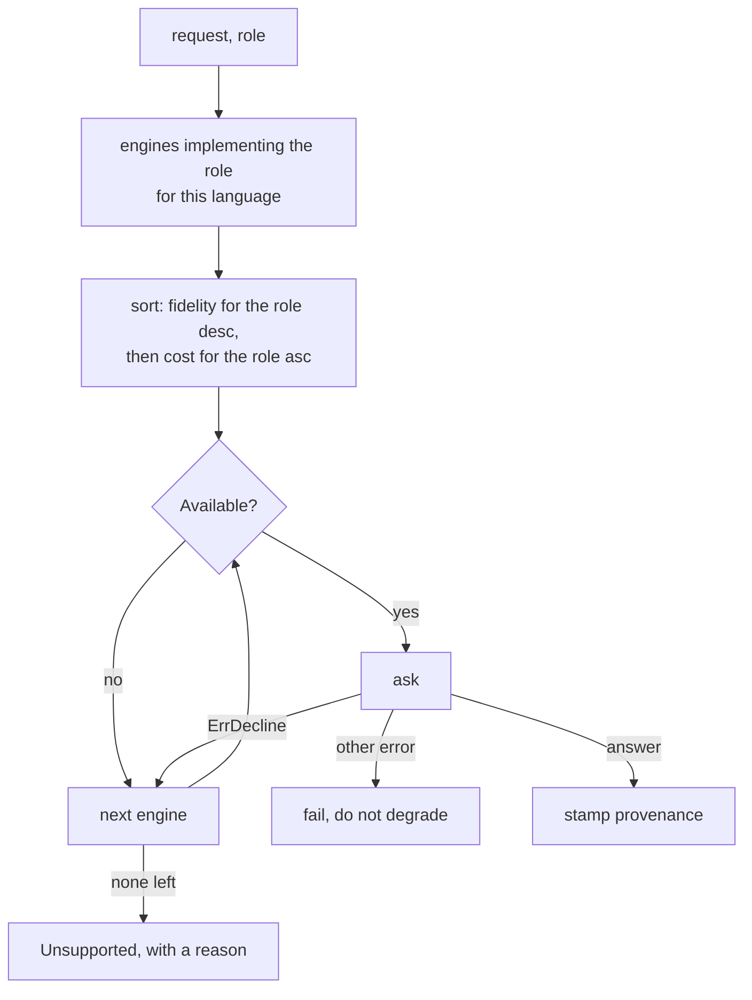

# RFC-0002: The read contract

## Summary

The types every engine and service names, the eight ports an engine may
implement, and how the catalogue picks one. It splits how an answer was
bound from whether the engine saw everything, because reading an empty
list as "there are none" needs both, and a language server can bind a
name through a type system while still holding a partial index.

## Motivation

RFC-0001 fixed which module the ports live in and left what they are to a
later proposal. Milestone 0000 delivers them, so no code can start until
this is settled.

Two things make the shape expensive to get wrong.

Five languages arrive in one milestone. A port that fits one grammar and
not the other four is found out after five modules are written against
it, not after one.

The second is a hole the current documents leave open. Only `Resolved`
evidence was going to license a negative claim, and language servers were
going to answer at `Indexed`. Together those say that "find every caller"
can never be trusted as complete in Python, Java, Rust or TypeScript,
which is four of the five languages and most of the value of the tool.
Letting a server claim `Resolved` instead trades that for a worse
failure: a server still building its index answers "no callers" with the
same confidence as one that has finished, and an agent deletes live code.

Neither is acceptable, and neither is fixable by moving a language
between tiers. The two questions are different questions.

## Detailed design

### Fidelity and completeness are separate

```go
// Package trust describes the evidence behind an answer.
package trust

// Fidelity says how an answer was bound.
type Fidelity uint8

const (
	// None means nothing could answer.
	None Fidelity = iota
	// Syntactic means a parser matched text. Links that cross a file
	// are name coincidence.
	Syntactic
	// Indexed means an index resolved the reference without a type
	// checker agreeing.
	Indexed
	// Resolved means a type checker bound the name to a declaration.
	Resolved
)

// Completeness says whether the engine covered the scope it was asked
// about.
type Completeness uint8

const (
	// ScopeUnknown means the engine cannot say what it covered.
	ScopeUnknown Completeness = iota
	// ScopePartial means the engine names what it missed. Read the caveats.
	ScopePartial
	// ScopeTotal means every file in the requested scope was examined.
	ScopeTotal
)

// SupportsNegativeClaim reports whether an empty answer means there are
// none, rather than that none were found. It takes both: a type checker
// bound the name, and the engine covered the whole scope.
func SupportsNegativeClaim(f Fidelity, c Completeness) bool {
	return f == Resolved && c == ScopeTotal
}
```

A language server that resolves through the type system reports
`Resolved` for the roles where it does, and reports its own completeness
honestly: `ScopeTotal` once its index is built and the workspace is the
scope it indexed, `ScopePartial` while it is still warming, and
`ScopeUnknown` if it cannot tell. An agent asking for callers gets a
trustworthy negative from any language whose server reports both, and
never gets one from a server that is mid-index.

This is the one place the proposal departs from treating fidelity as a
single ordering. Everything else follows from it.

### source

```go
// Package source names where code lives.
package source

// Language identifies a language across every request and answer.
//
// The type lives in core because core names languages constantly and
// knows none of them. The values do not: each language module declares
// its own, so deleting that module removes every mention of the language
// from the tree. The set is open, and two modules claiming one value are
// rejected at registration.
type Language string

// Path is slash-separated and relative to the workspace root, on every
// platform. Absolute paths never cross a port.
type Path string

// Position is a byte offset and the line and column it falls on. All
// three are zero-based and counted in bytes. Engines that speak a
// protocol using UTF-16 code units convert at their own boundary and
// never hand those units to a service.
type Position struct {
	Offset int
	Line   int
	Column int
}

// Span is a half-open range: Start is included, End is not.
type Span struct {
	Path  Path
	Start Position
	End   Position
}
```

Byte offsets rather than line and column alone, because every engine
needs to slice the file and only some can count columns cheaply. Line and
column travel with the offset so an answer stays readable without the
file.

### sema

```go
// Package sema describes what code means.
package sema

// ID identifies a symbol across processes and across runs. Moving a
// declaration inside its file does not change it, so an index may store
// it and a later process may still resolve it.
//
// The form is language:unit#qualified-name:kind, for example
// go:./internal/fsx#Digest:function.
type ID string

// Kind is what a symbol is. The set is smaller than any one language's
// grammar and larger than the weakest engine can tell apart: it is sized
// for the strongest engine, because a kind the vocabulary cannot express
// would make a stronger tier lossy for no reason. A distinction only one
// language draws is not carried.
type Kind uint8

const (
	KindUnknown Kind = iota
	KindModule
	KindPackage
	KindFile
	KindType
	KindStruct
	KindEnum
	KindEnumMember
	KindInterface
	KindFunction
	KindMethod
	KindConstructor
	KindField
	KindVariable
	KindConstant
)

// Symbol is one declaration.
type Symbol struct {
	ID       ID
	Name     string
	Kind     Kind
	Language source.Language
	Span     source.Span
	Parent   ID     // empty at the top level of a unit
	Exported bool
	Doc      string // the output budget drops this first
}

// RelationKind is how one symbol connects to another. Every kind has an
// inverse, so a caller asks in the direction it wants and the engine
// does not have to offer both.
type RelationKind uint8

const (
	// RelationUnknown means the edge was not classified. It has no
	// inverse.
	RelationUnknown RelationKind = iota
	Calls
	CalledBy
	Implements
	ImplementedBy
	References
	ReferencedBy
	Imports
	ImportedBy
	Embeds
	EmbeddedBy
)

// Relation is one edge, and where in the source it was found.
type Relation struct {
	Kind RelationKind
	From ID
	To   ID
	At   source.Span
}

// Unit is what a language calls the thing a file belongs to: a package
// in Go, a module in Python, a crate module in Rust.
type Unit struct {
	ID       ID
	Name     string
	Language source.Language
	Root     source.Path
	Files    []source.Path
}
```

`ID` is a string rather than a struct so it can be a map key, a JSON
field and an index key without conversion. Deriving it from the unit and
the qualified name rather than from a byte offset is what lets an index
survive an edit that moves a declaration down a file.

### trust, continued

```go
// Status is what happened to a request. It is not a severity, and an
// empty payload means something different in each case.
type Status uint8

const (
	// Unset means nobody assigned a status. It is never valid on an
	// answer that left a service.
	Unset Status = iota
	// OK means an engine answered at the fidelity it advertises.
	OK
	// Degraded means an engine answered below the fidelity the caller
	// asked for.
	Degraded
	// Partial means some of the requested scope was not covered.
	Partial
	// Unsupported means nothing can answer this. There is no payload.
	Unsupported
	// Refused means the system declined: policy, or the target does not
	// exist.
	Refused
)

// Provenance is what stands behind one answer. Services build it;
// engines never do.
type Provenance struct {
	Engine       string
	Fidelity     Fidelity
	Completeness Completeness
	Caveats      []Caveat
}

// Caveat is a limit on an answer that the fidelity does not express.
type Caveat struct {
	Code  CaveatCode
	Note  string
	Paths []source.Path // the files this is about, when it names any
}

// CaveatCode is a closed set, so a caller can branch on one without
// matching prose.
type CaveatCode string

const (
	CaveatStale         CaveatCode = "stale"
	CaveatTruncated     CaveatCode = "truncated"
	CaveatBuildBroken   CaveatCode = "build-broken"
	CaveatIndexWarming  CaveatCode = "index-warming"
	CaveatDynamic       CaveatCode = "dynamic"
	CaveatInactiveBuild CaveatCode = "inactive-build-tags"
	CaveatCrossLanguage CaveatCode = "cross-language"
	CaveatUnrouted      CaveatCode = "unrouted"
	CaveatUnsupported   CaveatCode = "unsupported"
	CaveatUnread        CaveatCode = "unread"
)
```

`Provenance` holds no cost. What an answer cost is a selection concern
and tells a caller nothing it can act on.

`CaveatDynamic` is the one every resolved answer carries: reflection,
string-keyed dispatch, struct tags and runtime patching are invisible to
every engine here, so even `Resolved` and `Total` together mean "there
are none that static analysis can see".

### Every enum's zero value means nothing was chosen

`Status` starts at `Unset`, `Role` at `RoleUnset`, `Completeness` at
`ScopeUnknown`, `edit.TargetKind` at `TargetUnset`, `edit.ChangeKind` at
`ChangeUnset` and `diag.Severity` at `SeverityUnset`.

A struct field nobody assigned then reads as absent rather than as a
valid choice. The alternative puts the commonest value at zero, which is
convenient until a service forgets to set one and the answer claims to
have succeeded.

The coverage values carry a `Scope` prefix because `Status` also has a
`Partial` and both live in `trust`. `Status` is named on every answer, so
it keeps the bare names.

### The ports

Eight roles. An engine declines one by not having the method, so a
capability gap is a missing method rather than an error at run time.

```go
// Package engine holds the plug-in contract.
package engine

type Role uint8

const (
	RoleOutline Role = iota
	RoleSearch
	RoleResolve
	RoleRelate
	RolePlan
	RoleFormat
	RoleVerify
	RoleIndex
)

// Result is what an engine returns. It carries what the engine found and
// the limits only the engine knows, and no field it could use to
// overstate itself: an engine names neither itself nor its tier.
type Result[T any] struct {
	Items        []T
	Completeness trust.Completeness
	Caveats      []trust.Caveat
}

// Answer is what a service publishes. Publish stamps the provenance from
// the engine that answered, and derives the status in one place so what
// counts as degraded cannot drift between roles.
type Answer[T any] struct {
	Items      []T
	Status     trust.Status
	Provenance trust.Provenance
}

func Publish[T any](r Result[T], e Engine, role Role, want trust.Fidelity) Answer[T]

// Request is the scope of a question.
type Request struct {
	Scope     source.Path     // one file or one directory
	Language  source.Language
	Preferred trust.Fidelity  // the caller's minimum; a weaker answer is marked Degraded
}

// Query is what to search for. Text matches symbol names fuzzily and
// doc comments by content, so a caller that knows neither the exact name
// nor the package can still find something. A caller that knows the name
// passes the name and gets an exact match first.
type Query struct {
	Text    string    // a name, or a description of the thing
	Kind    sema.Kind // zero means any kind
	Private bool      // include unexported declarations
	Limit   int       // zero means the engine's default
}

// ErrDecline says this engine cannot answer this particular request.
// The catalogue moves on to the next engine. Any other error stops
// selection, because substituting a weaker answer for a broken engine
// hides the breakage.
var ErrDecline = errors.New("engine: decline")

type Outliner interface {
	Outline(ctx context.Context, req Request) (Result[sema.Symbol], error)
}

type Searcher interface {
	Search(ctx context.Context, req Request, q Query) (Result[sema.Symbol], error)
}

type Resolver interface {
	Resolve(ctx context.Context, req Request, at source.Position) (Result[sema.Symbol], error)
}

type Relator interface {
	Relate(ctx context.Context, req Request, of sema.ID, kind sema.RelationKind) (Result[sema.Relation], error)
}

type Planner interface {
	Plan(
		ctx context.Context,
		req Request,
		op edit.Operation,
		target edit.Target,
		args edit.Args,
	) (Result[edit.Change], error)
}

type Formatter interface {
	Format(ctx context.Context, paths []source.Path) (Result[edit.Change], error)
}

type Verifier interface {
	Verify(ctx context.Context, req Request) ([]diag.Diagnostic, error)
}

type Indexer interface {
	Index(ctx context.Context, p source.Path) ([]sema.Symbol, []sema.Relation, error)
	// Granularity is static: how far this engine's facts can ever reach.
	Granularity() Invalidation
	// Affected is dynamic: given this file changed, which paths must be
	// indexed again.
	Affected(changed source.Path) []source.Path
}
```

A planner returns a plan and is handed no filesystem, so atomicity is
implemented once in the write path and no engine can weaken it. What a
plan contains is settled in the write-path proposal, not here.

Invalidation is stated twice because an index asks two different
questions: once, when deciding whether adopting an engine is affordable,
and again on every edit.

### Engines, cost and availability

```go
// Engine is what every adapter implements, on top of whichever roles it
// serves.
type Engine interface {
	Name() string
	Language() source.Language
	// Fidelity is per role. A language server commonly binds references
	// through the type system while returning a document outline its
	// parser produced, and those are different claims.
	Fidelity(Role) trust.Fidelity
	Cost(Role) Cost
}

// Available is implemented by an engine that depends on something
// outside the process. The catalogue skips one that cannot run and says
// why, rather than advertising a capability that is not there.
type Available interface {
	Available(ctx context.Context) error
}

// Cost is what producing an answer takes. It is independent of fidelity:
// a warm index and the parser that filled it produce the same facts, and
// one costs a map lookup where the other costs a parse.
type Cost uint8

const (
	CostMemory  Cost = iota // a map lookup
	CostParse               // parse one file
	CostAnalyze             // type-check a package graph
	CostSession             // expensive once, cheap afterwards
	CostProcess             // a subprocess per call
)
```

`CostSession` exists because a language server indexes a workspace on
startup and answers in milliseconds after that. Pricing it at the cost of
its first call would make the catalogue avoid the fastest engine it has.

### Selection



Strongest evidence first, and the cheapest way to get it among equals.
One generic dispatcher serves all five read roles, so what counts as
degraded cannot drift between outline and relations.

An engine that declines falls through. An engine that fails does not,
because quietly answering from a weaker engine when the stronger one is
broken hides the breakage for as long as anyone believes the answer.

### Capability as a value

```go
// Capability is what the catalogue can answer for one language and role.
type Capability struct {
	Language     source.Language
	Role         Role
	Fidelity     trust.Fidelity
	Completeness trust.Completeness
	Cost         Cost
	Engine       string
	Unavailable  string // why not, when it cannot run
}

// Add registers an engine. It reports an error when the name is taken:
// a provenance names the engine that answered, so two engines sharing a
// name make an answer untraceable.
func (c *Catalog) Add(e Engine) error

// For returns the engines that can answer this role for this language,
// strongest evidence first and cheapest among equals. An engine that
// does not serve the role, serves another language, or cannot run is
// left out.
func (c *Catalog) For(ctx context.Context, lang source.Language, role Role) []Engine

func (c *Catalog) Capabilities(ctx context.Context) []Capability
```

"We cannot rename Python here" becomes a value a caller reads, rather
than knowledge spread through dispatch code.

### An engine that read nothing has no evidence to merge

A scope holding more than one language is asked of all of them, and the
merged answer takes the weakest tier and the least coverage any of them
reported. That is right for an engine that read the files and found
nothing: it searched forty of them and matched none, it still cannot say
there are no others, and its silence is what stops the merged answer
claiming there are.

It is wrong for an engine that read nothing. A directory with no Ruby in
it tells you nothing about Ruby, and a Ruby parser saying so must not
lower what a type checker beside it is worth. Left in, the same two
declarations from the same engine come back `resolved` when the file is
named and `syntactic` when the directory holding it is, and the negative
claim the caller had earned is withdrawn on the way.

An engine therefore reports whether the scope held any file it reads,
and a service leaves those answers out of the evidence. Where no engine
read anything the answers all count, because a scope nothing examined is
not one to report the strongest tier over.

The signal counts by default: an engine that does not set it is merged
as it always was. Setting it wrongly costs an answer its say, and
forgetting it costs only the precision it exists for.

## Alternatives considered

### A. Fidelity alone decides a negative claim

Keep one ordered enum. Only `Resolved` licenses reading an empty list as
"there are none", and a language server sits at `Indexed`.

**Why not:** four of the five languages then never license a negative
claim, whatever their server knows. "Find every caller" is the question
agents ask before deleting code, and answering it usefully only in Go
would make the other four languages read-only in practice.

### B. Let a language server claim `Resolved` and say nothing about coverage

One enum, and an LSP engine reports `Resolved` for the roles where the
server binds through types.

**Why not:** a server that is still building its index answers "no
callers" indistinguishably from one that has finished. That is the
failure the fidelity contract exists to prevent, moved from the tier
boundary to the timing of the request.

### C. A fifth tier between `Indexed` and `Resolved`

Add something like `ResolvedPartial` for a type-checked answer over an
incomplete scope.

**Why not:** it makes the enum no longer a single ordering. Sorting
engines by fidelity is what the catalogue does, and a tier that is
stronger on binding and weaker on coverage has no correct position in
that sort. Two fields sort independently and compose without ambiguity.

### D. One boolean on the engine: "trust my negatives"

Let each engine report whether its empty answers are authoritative.

**Why not:** it puts the judgement in the adapter, which is exactly what
RFC-0001 keeps engines from doing with provenance. An engine that
overstates it cannot be caught by a service, and the rule would drift
between adapters.

## Drawbacks

- Two fields instead of one. Every answer carries both, every service
  compares both, and a caller reading only fidelity gets a subtly wrong
  idea of what an empty list means.
- `Completeness` is a claim an engine makes about itself, so an engine
  that reports `Total` when it skipped a file is not caught by anything
  here. The conformance suite has to test it against a workspace with a
  known symbol count.
- Eight ports is eight interfaces to keep stable across five language
  modules. Three more are named in the prototype and left out here, so
  adding one later is a change to the contract module.
- `Answer[T]` uses generics, so the dispatcher is generic over role and
  item type. That is one type parameter in a lot of signatures.
- `sema.ID` embeds a qualified name, so renaming a symbol changes every
  ID that mentions it. An index has to reindex the unit rather than
  patching entries.

## Unresolved and future work

Whether one scorer can serve both declaration names and doc comments
without one drowning the other is a question for the first engine that
implements `Search`.

Three roles from the prototype are not proposed here: reporting what
units a project is made of, deriving edges a framework's conventions
imply, and asking a language server for the fixes it would offer for a
diagnostic. Each needs a consumer before it needs a port.

Narrowing a request to what changed since a version-control ref is not
proposed, and techne understands no version control. A caller that wants
it resolves the ref itself and passes paths, which its own tooling does
correctly and this would have to reimplement. "Changed since" means at
least four different sets depending on whether staged and untracked files
count, and getting that wrong would let an answer report total coverage
of a scope that silently missed files, which is the failure this
proposal's completeness field exists to prevent.

The shape of a plan, the operation catalogue and the write pipeline are a
separate proposal.

How an answer is rendered for an agent, including what gets dropped when
it is too large, is a separate proposal.

## References

| What | Where |
|---|---|
| LSP position encoding, UTF-16 code units by default | https://microsoft.github.io/language-server-protocol/specifications/lsp/3.17/specification/#textDocuments |
| Go generics and type parameters on interfaces | https://go.dev/ref/spec#Type_parameter_declarations |
